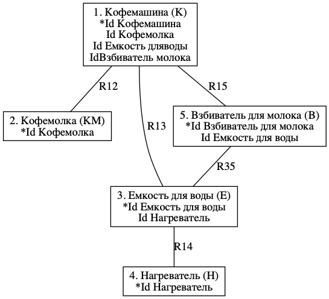
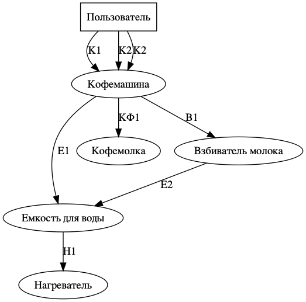
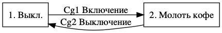
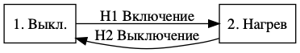
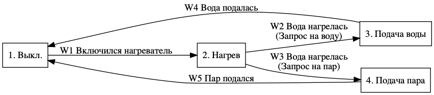
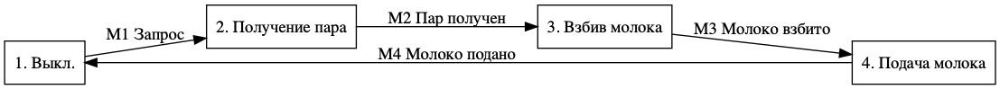
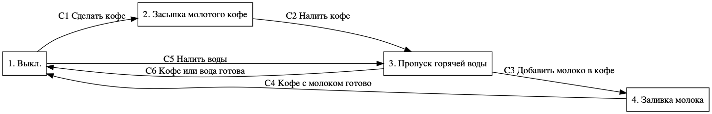
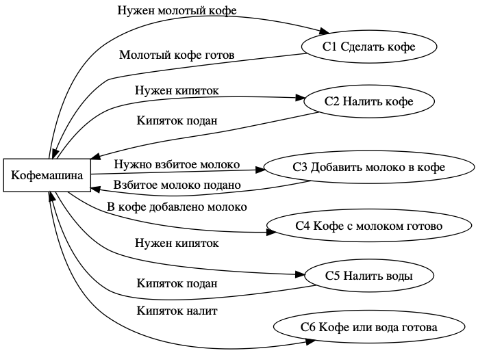
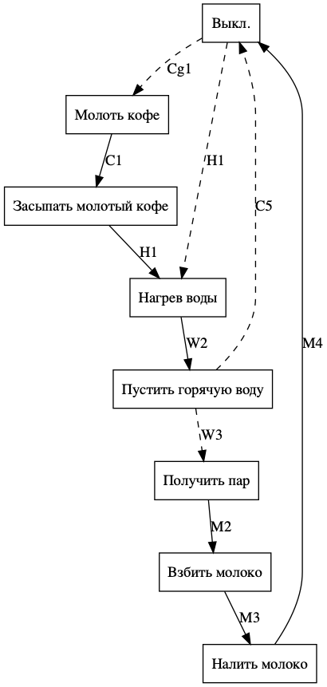

# Кофемашина

## Информационная модель

## Модель взаимодействия

## Диаграмма перехода состояний

### Кофемолка

|       |  C1  |  C2  |
| :---: | :--: | :--: |
| **1** |  2   |  X   |
| **2** |  X   |  1   |

### Нагреватель

|       |  H1  |  H2  |
| :---: | :--: | :--: |
| **1** |  2   |  X   |
| **2** |  X   |  1   |

### Емкость для воды

|       |  W1  |  W2  |  W3  |  W4  |  W5  |
| :---: | :--: | :--: | :--: | :--: | :--: |
| **1** |  2   |  X   |  X   |  X   |  X   |
| **2** |  X   |  3   |  X   |  X   |  X   |
| **3** |  X   |  4   |  X   |  1   |  X   |
| **4** |  X   |  X   |  X   |  X   |  1   |

### Взбиватель молока

|       |  M1  |  M2  |
| :---: | :--: | :--: |
| **1** |  2   |  X   |
| **2** |  X   |  1   |

### Кофемашина

|       |  С1  |  С2  |  С3  |  С4  |  С5  |  C6  |
| :---: | :--: | :--: | :--: | :--: | :--: | :--: |
| **1** |  2   |  X   |  X   |  X   |  3   |  X   |
| **2** |  X   |  3   |  X   |  X   |  X   |  X   |
| **3** |  X   |  X   |  4   |  X   |  X   |  1   |
| **4** |  X   |  X   |  X   |  1   |  X   |  X   |

## Диаграмма потоков данных действий (ДПДД) 

### Взбиватель молока

## Канал управления

